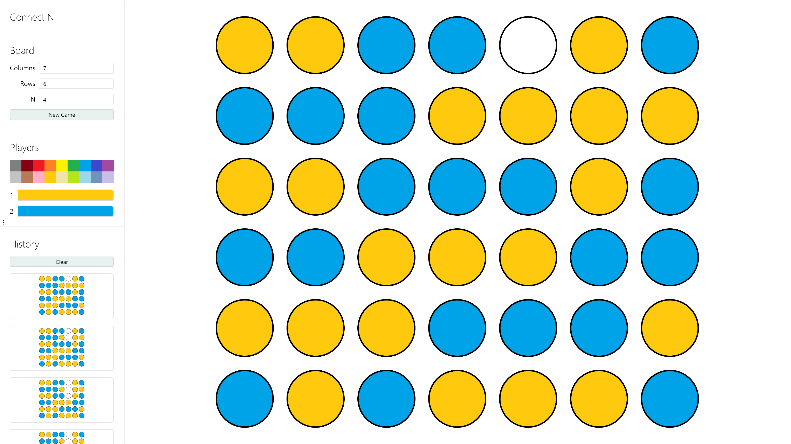

# Connect N

Connect N is an offline-first PWA multiplayer connection board game. You decide the number of columns and rows. The first player to form a horizontal, vertical, or diagonal line of N pieces wins the game.

## Demo

You can play with your friends in person or with AI at https://kamide.github.io/connect-n/

## Controls

You can play using a mouse or touchscreen by clicking and dragging. You can also play using a keyboard as follows.

| Action              | Key                                  |
| ------------------- | ------------------------------------ |
| Move Left           | <kbd>A</kbd> or <kbd>←</kbd>         |
| Move Right          | <kbd>D</kbd> or <kbd>→</kbd>         |
| Drop Piece          | <kbd>S</kbd> or <kbd>↓</kbd>         |
| Take Back Piece     | <kbd>W</kbd> or <kbd>↑</kbd>         |
| Go to First Column  | <kbd>1</kbd> or <kbd>Delete</kbd>    |
| Go to Middle Column | <kbd>2</kbd> or <kbd>End</kbd>       |
| Go to Last Column   | <kbd>3</kbd> or <kbd>Page Down</kbd> |
| Restart Game        | <kbd>Backspace</kbd>                 |
