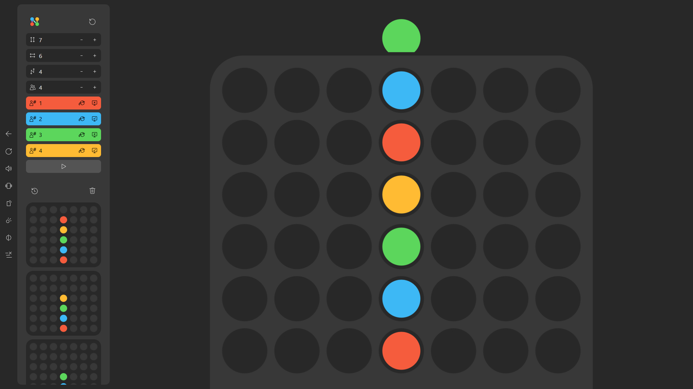

# Connect N

Connect N is a PWA multiplayer connection board game.

You decide the number of columns and rows.

The first person to form a horizontal, vertical, or diagonal line of N pieces wins the game.

## Demo

You can play with your friends over the board at https://kamide.github.io/connect-n/
